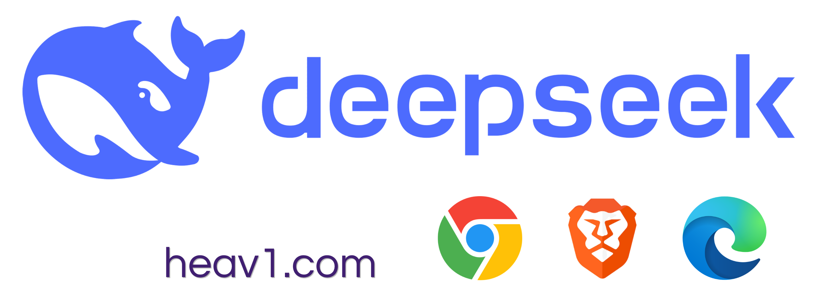
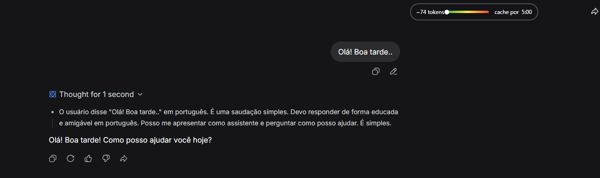

# 🔢 DeepSeek Counter — Moderner Token-Zähler mit Farbverlaufs-UI

  

**DeepSeek Counter** ist eine Browsererweiterung, die einen Echtzeit-Token-Zähler, Cache-Timer und eine schöne Verlaufsleiste (grün → rot) direkt in die DeepSeek-Oberfläche (`chat.deepseek.com`) einfügt. Von Grund auf neu entwickelt, um ein sauberes und optisch ansprechendes Erlebnis zu bieten.

---

## 🌐 Dieses Dokument in anderen Sprachen lesen

- [English](./README.md)
- [Português (Brasil)](./README.pt-BR.md)
- [Español](./README.es.md)
- [简体中文](./README.zh-CN.md)
- [हिन्दी](./README.hi.md)
- [Français](./README.fr.md)
- [日本語](./README.ja.md)
- [한국어](./README.ko.md)
- [Русский](./README.ru.md)
- [العربية](./README.ar.md)

---

## 🚀 Funktionen

- 🔢 **Akkumulierter Token-Zähler** – summiert die Token aller Nachrichten der aktuellen Unterhaltung (Schätzung basierend auf dem `o200k_base` Tokenizer). Die Gesamtzahl wird in `sessionStorage` gespeichert, so dass sie beim Neuladen der Seite nicht zurückgesetzt wird.
- 🎯 **Verlaufsbalken und weißer Punkt** – der Balken hat einen festen Farbverlauf (grün → rot) und einen **weißen Punkt**, der sich bewegt, um den genutzten Prozentsatz anzuzeigen (Referenzlimit 200.000 Token).
- ⏳ **Cache-Timer** – zeigt an, wie lange die Unterhaltung noch im Cache verbleibt (5 Minuten ab der letzten Antwort des Assistenten). Zwischengespeicherte Nachrichten sind günstiger und schneller.
- 🌗 **Automatische Themenanpassung** – der Zähler passt sich dem hellen oder dunklen Thema des Systems an (Textfarbe, Tooltip-Hintergrund usw.).
- 📌 **Feste Positionierung** – der Zähler befindet sich in der **oberen rechten Ecke** (Abstand einstellbar), ohne die Benutzeroberfläche zu überlappen.
- 🔄 **Echtzeit-Updates** – jede gesendete oder empfangene Nachricht aktualisiert den Zähler sofort.

---

## 🤔 Wie werden Token bei DeepSeek berechnet?

Wie andere Sprachmodelle zerlegt DeepSeek Text in **Token** – Einheiten, die Wörter, Wortteile oder Sonderzeichen sein können. Die Anzahl der Token wirkt sich direkt auf die Rechenkosten und die Nutzung des Kontextfensters aus.

### 📊 Kontextlimit (Referenz)

- DeepSeek hat ein maximales Kontextfenster von **1 Million Token** (1.000.000).
- Der in dieser Erweiterung verwendete Tokenizer (`o200k_base`) wurde ursprünglich für OpenAI-Modelle entwickelt und **entspricht nicht genau der nativen Tokenisierung von DeepSeek**.
- Daher verwenden wir ein **Referenzlimit von 200.000 Token** (nur für die visuelle Balkenskala). Die Zahlenangabe ist weiterhin eine **Näherung**, die hilft, den Verbrauch einzuschätzen.

### ⚙️ Wie die Erweiterung Token zählt

1. **Nachrichtenextraktion** – Das Skript `content.js` identifiziert jeden Textblock, der von Ihnen und vom Assistenten gesendet wurde, anhand stabiler CSS-Klassen (`.ds-message`, `.fbb737a4` usw.).
2. **Tokenisierung** – Jede neue Nachricht wird vom Tokenizer `o200k_base.js` verarbeitet, der eine ungefähre Token-Anzahl zurückgibt.
3. **Akkumulation** – Die Token aller Nachrichten der aktuellen Unterhaltung werden summiert und in `sessionStorage` gespeichert. Selbst wenn Sie die Seite neu laden, geht die akkumulierte Gesamtzahl nicht verloren.
4. **Echtzeit-Update** – Sobald eine neue Nachricht gesendet oder empfangen wird, aktualisiert sich der Zähler automatisch (mit `MutationObserver` und `setInterval`).

### 📈 Den Verlaufsbalken und den weißen Punkt verstehen

- Der **Verlaufsbalken** stellt die Skala von **0% bis 100%** des Referenzlimits (200.000 Token) dar.  
  - **Grün** zu Beginn (0%) → **Rot** am Ende (100%).
- Der **weiße Punkt** bewegt sich auf dem Balken und zeigt genau den Prozentsatz der bereits in der aktuellen Unterhaltung verwendeten Token an.
- Unter dem Balken sehen Sie die **absolute Token-Anzahl** (z.B. `~61.332 Token`).

### ⏱️ Cache-Timer

- Jedes Mal, wenn der Assistent antwortet, startet ein **5‑Minuten‑Timer**.  
- Während dieses Zeitraums gilt die Unterhaltung als „gecached“, was bedeutet, dass weitere Interaktionen schneller und kostengünstiger sein sollten.  
- Der Zähler zeigt genau an, wie viel Zeit verbleibt, bis der Cache abläuft.

---

## 🛠️ Installation

### Chrome / Edge / andere Chromium-Browser

1. **Laden Sie die Erweiterungsdateien herunter** (klonen Sie dieses Repository oder laden Sie das ZIP herunter und entpacken Sie es in einen Ordner).
2. Gehen Sie zu `chrome://extensions` (oder `edge://extensions`).
3. Aktivieren Sie den **Entwicklermodus** (Schalter oben rechts).
4. Klicken Sie auf **"Entpackte Erweiterung laden"**.
5. Wählen Sie den **Ordner** aus, in dem Sie die Erweiterungsdateien gespeichert haben.
6. Fertig! Die Erweiterung wird in der Liste angezeigt. Gehen Sie nun zu `chat.deepseek.com` und sehen Sie den Zähler in Aktion.

### Firefox (temporäre Installation)

1. Gehen Sie zu `about:debugging`.
2. Klicken Sie auf **"Dieser Firefox"**.
3. Klicken Sie auf **"Temporäre Erweiterung laden"**.
4. Wählen Sie eine beliebige Datei im Erweiterungsordner aus (z. B. `manifest.json`).
5. Die Erweiterung wird geladen. Für eine dauerhafte Nutzung müssen Sie die Erweiterung signieren.

---

## ⚙️ Wie es funktioniert (technisch)

- **`content.js`** – Extrahiert Nachrichten aus dem DOM von DeepSeek mithilfe stabiler Selektoren (`.ds-message`, `.fbb737a4`). Jede neue Nachricht wird tokenisiert und die Token in `sessionStorage` akkumuliert.
- **`ui.js`** – Injiziert einen festen Container in den `body` mit `position: fixed`, halbtransparentem Hintergrund, Verlaufsbalken, weißem Punkt und Tooltips, die sich an das helle/dunkle Thema anpassen.
- **`o200k_base.js`** – Tokenizer (MIT) – wird nur für die ungefähre Zählung verwendet. Die gesamte Anerkennung für diese Datei gebührt dem [gpt-tokenizer](https://github.com/niieani/gpt-tokenizer) Projekt.
- **Updates** – `MutationObserver` überwacht DOM-Änderungen und `setInterval` (alle 2 Sekunden) hält die Daten aktuell.

---

## 🔒 Datenschutz

- ✅ Alle Daten verbleiben **lokal** in Ihrem Browser (`sessionStorage`).
- ✅ Es werden keine Daten an externe Server gesendet.
- ✅ Die Erweiterung führt Code nur auf der Domain `chat.deepseek.com` aus.
- ✅ Es wird kein Tracking oder Telemetrie verwendet.

---

## 🙏 Danksagungen

- 🧮 **Tokenizer** – [gpt-tokenizer](https://github.com/niieani/gpt-tokenizer) (MIT) – Datei `o200k_base.js`.
- 🎨 **Übersetzung, visuelles Design und DeepSeek-Integration** – [@havylliard](https://github.com/havylliard) (Verlaufsbalken, weißer Punkt, Positionierung, Anpassung an helles/dunkles Thema, Mehrsprachigkeit).
- 💡 **Architektonische Inspiration** – Der [Claude Counter](https://github.com/she-llac/claude-counter) diente als Referenz, aber der gesamte Code für die Nachrichtenextraktion, die Akkumulationslogik und die Benutzeroberfläche wurde **von Grund auf** für DeepSeek geschrieben.

---

## 📄 Lizenz

MIT

---

## ❤️ Hinweis des Autors

Diese Erweiterung entstand aus dem Bedürfnis nach einem einfachen, schönen und funktionalen Token-Zähler für DeepSeek, da die Plattform diese Funktion noch nicht nativ anbietet.  

**Viel Erfolg beim Prompten und gute Gespräche!** 🚀